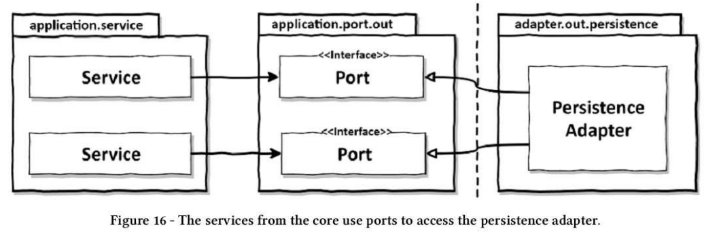
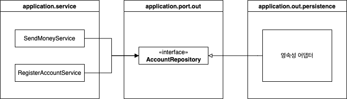
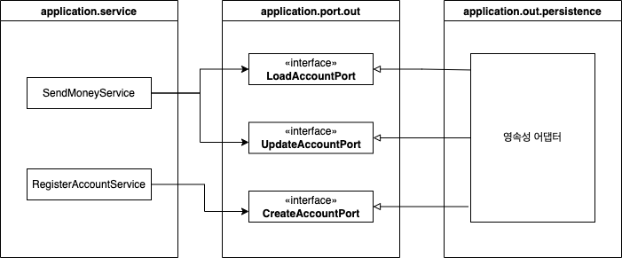
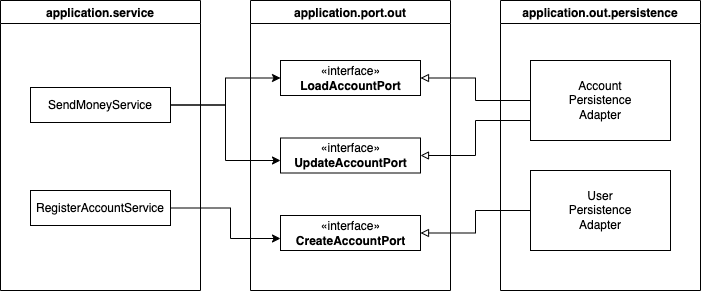
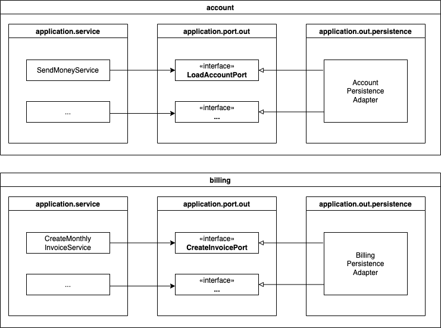

# 06 영속성 어댑터 구현하기

전통적 계층형 아키텍처의 문제점 중 하나가 모든 것이 영속성 계층에 의존하는 데이터베이스 주도 설계라고 했었다. 이러한 의존성을 역전시키기 위해 영속성 계층을 어플리케이션 계층의 플러그인으로 만드는 방법을 알아보자.


## 의존성 역전



***코어의 서비스가 영속성 어댑터에 접근하기 위해 포트 사용***

서비스는 영속성 기능을 호출을 위해 포트 인터페이스를 호출한다. 이 포트는 영속성 어댑터에 의해 구현된다. 서비스와 어댑터 사이의 <u>포트는 영속성 문제에 신경 쓰지 않고 도메인 코드를 개발하기 위해, 영속성 계층에 대한 코드 의존성을 없애준다.</u> 영속성 코드를 리팩터링하더라도 코어 코드를 변경하는 결과로 이어지지 않는 것이다.


## 영속성 어댑터의 책임

1. 입력을 받는다.

   > <u>영속성 어댑터의 입력 모델이 영속성 어댑터 내부에 있는 것이 아니라 애플리케이션 코어에 있기 때문에 영속성 어댑터 내부를 변경하는 것이 코어에 영향을 미치지 않는다.</u>
2. 입력을 데이터베이스 포맷으로 변경한다.

   > 포트 인터페이스로부터 입력 모델을 받아 데이터베이스를 쿼리하거나 변경하는데 사용할 수 있는 포맷으로 입력 모델을 매핑한다. (예를들어 JPA 엔티티 객체)
3. 입력을 데이터베이스로 보낸다.
4. 데이터베이스 출력을 애플리케이션 포맷으로 매핑한다.
5. 출력을 반환한다.

데이터베이스와 통신하기 위해 어떤 기술을 사용해도 상관 없어진다. 입력 모델을 JPA 엔티티로 매핑하든 SQL 구문에 매핑하든 코어에서는 알 필요가 없는 것이다.

그러나 영속성 어댑터를 위와 같이 구현하면 전통적인 영속성 계층을 구현할 때는 없었던 몇 가지 의문이 생긴다. 이에 대해 얘기해보도록 하자.


## 포트 인터페이스 나누기

서비스를 구현하면서 생기는 의문은 데이터베이스 연산을 정의하고 있는 포트 인터페이스를 어떻게 나눌까이다.




***넓은 아웃고잉 포트 인터페이스***

위와 같이 특정 엔티티가 필요로하는 모든 데이터베이스 연산을 하나의 리포지토리 인터페이스에 넣어두는 것이 일반적이다. 그러면 이 데이터베이스에 의존하는 여러 서비스는 리포지토리에서 하나의 메소드만 사용하더라도 넓은 포트 인터페이스에 의존성을 갖게 된다. <u>코드에 불필요한 의존성이 생긴 것이다.</u>

`SendMoneyService` 테스트를 진행하는데, 리포지토리의 어떤 메소드를 모킹해야할까? 코드를 찾아봐야 하는 불편함이 생길 것이다. 또한 전체를 모킹했다고 생각하고 사용했는데 일부만 모킹한 것이 문제가 될 때도 있을 것이다.




***인터페이스 분리 원칙 적용***

<u>인터페이스 분리 원칙(Interface Segregation Principle, ISP)는 이 문제의 답이 될 수 있다.</u> 이 원칙은 클라이언트가 오로지 자신이 필요로 하는 메서드만 알면 되도록 넓은 인터페이스를 특화된 인터페이스로 분리하게 한다.

이렇게 매우 좁은 포트를 만듬으로서 코딩을 **플러그 앤드 플레이 경험**으로 만든다. 서비스 코드를 짤 때는 필요한 포트에 그저 꽂기만 하면 된다.


## 영속성 어댑터 나누기

지금까지는 모든 영속성 포트를 구현한 단 하나의 영속성 어댑터 클래스를 사용했다. 하나 이상의 어댑터 생성을 강제하는 규칙은 없다.




***애그리거트당 하나의 영속성 어댑터 생성***

위 그림은 영속성 연산이 필요한 **도메인 클래스 하나당 하나의 영속성 어댑터를 구현하는 방식**이다. <u>이렇게하면 영속성 어댑터들이 각 영속성 기능을 이용하는 도메인 경계를 따라 자동으로 나눠진다.</u>  이러한 애그리거트당 하나의 영속성 어댑터 접근방식 또한 여러 개의 바운디드 컨텍스트의 영속성 요구사항을 분리하기 위한 좋은 토대가 된다. 




***바운디드 컨텍스트 당 영속성 어댑터 하나씩 가지는 설계***

여러개의 바운디드 컨텍스트가 있는 애플리케이션을 위 그림처럼 바운디드 컨텍스트 당 영속성 어댑터를 하나씩 가지고 있도록 설계할 수 있다. 바운디드 컨텍스트라는 표현은 경계를 암시한다.  <u>account 맥락의 서비스가 billing 영속성에 접근하지 않고, 반대로도 접근하지 않게 된다.</u> 

어떤 맥락이 다른 맥락에 있는 것이 필요할 때면 전용 인커밍 포트를 통해 접근해야한다.


## 스프링 데이터 JPA 예제

위 그림을 스프링 프레임워크에서 구현하는 예제를 살펴보도록 하겠습니다.


***Account.java***

```java
package buckpal.domain;

@AllArgsConstructor(access = AccessLevel.PRIVATE)
public class Account {

	@Getter private final AccountId id;
	@Getter private final ActivityWindow activityWindow;
  private final Money baselineBalance;

	public static Account withoutId(
					Money baselineBalance,
					ActivityWindow activityWindow) {
		return new Account(null, baselineBalance, activityWindow);
	}

	public static Account withId(
					AccountId accountId,
					Money baselineBalance,
					ActivityWindow activityWindow) {
		return new Account(accountId, baselineBalance, activityWindow);
	}

  public Money calculateBalance() {
		// ...
	}
  
  public boolean withdraw(Money money, AccountId targetAccountId) {
    // ...
  }
  
  public boolean deposit(Money money, AccountId sourceAccountId) {
    // ...
  }
}
```

getter, setter만 가진 간단한 클래스가 아니며 최대한 불변성을 유지하려 하고 있다. 유효 상태의 `Account` 엔티티만 생성할 수 있도록 팩터리 메서드를 제공하고, 출금 전 유효성 검증 등과 같은 방법으로 유효하지 않은 도메인 모델이 생성되지 않도록 하고 있습니다.


***AccountJpaEntity.java***

```java
package buckpal.adapter.persistence;

@Entity
@Table(name = "account")
@Data
@AllArgsConstructor
@NoArgsConstructor
class AccountJpaEntity {

	@Id
	@GeneratedValue
	private Long id;

}
```

데이터베이스 통신에 스프링 데이터 JPA를 사용할 것이므로 계좌의 데이터베이스 상태를 표시하는 `@Entity` 애너테이션이 추가된 클래스도 필요하다.


**ActivityJpaEntity.java**

```java
package bukpal.adapter.persistence;

@Entity
@Table(name = "activity")
@Data
@AllArgsConstructor
@NoArgsConstructor
class ActivityJpaEntity {

	@Id
	@GeneratedValue
	private Long id;

	@Column	private LocalDateTime timestamp;
	@Column	private Long ownerAccountId;
	@Column	private Long sourceAccountId;
	@Column	private Long targetAccountId;
	@Column	private Long amount;
}
```

마찬가지로 activity 테이블을 표현하기 위한 클래스도 추가한다.


다음으로 기본적인 CRUD와 데이터베이스에서 활동들을 로드하기 위한 커스텀 쿼리를 제공하는 리포지토리 인터페이스를 생성하기 위해 스프링 데이터를 사용한다.

***AccountRepoistory.java***

```java
interface AccountRepository extends JpaRepository<AccountJpaEntity, Long> {
}
```

***ActivityRepoistory.java***

```java
interface ActivityRepository extends JpaRepository<ActivityJpaEntity, Long> {

	@Query("select a from ActivityJpaEntity a " +
			"where a.ownerAccountId = :ownerAccountId " +
			"and a.timestamp >= :since")
	List<ActivityJpaEntity> findByOwnerSince(
			@Param("ownerAccountId") Long ownerAccountId,
			@Param("since") LocalDateTime since);

	@Query("select sum(a.amount) from ActivityJpaEntity a " +
			"where a.targetAccountId = :accountId " +
			"and a.ownerAccountId = :accountId " +
			"and a.timestamp < :until")
	Long getDepositBalanceUntil(
			@Param("accountId") Long accountId,
			@Param("until") LocalDateTime until);

	@Query("select sum(a.amount) from ActivityJpaEntity a " +
			"where a.sourceAccountId = :accountId " +
			"and a.ownerAccountId = :accountId " +
			"and a.timestamp < :until")
	Long getWithdrawalBalanceUntil(
			@Param("accountId") Long accountId,
			@Param("until") LocalDateTime until);

}
```

스프링 부트는 이 리포지토리를 자동으로 찾고 스프링 데이터는 실제로 데이터베이스와 통신하는 리포지토리 인터페이스 구현체를 제공하는 마법을 부린다.


JPA 엔티티와 리포지토리를 만들었으니 영속성 기능을 제공하는 영속성 어댑터를 만들어보자.

***AccountPersistenceAdapter.java***

```java
@RequiredArgsConstructor
@PersistenceAdapter
class AccountPersistenceAdapter implements
		LoadAccountPort,
		UpdateAccountStatePort {

	private final SpringDataAccountRepository accountRepository;
	private final ActivityRepository activityRepository;
	private final AccountMapper accountMapper;

	@Override
	public Account loadAccount(
					AccountId accountId,
					LocalDateTime baselineDate) {

		AccountJpaEntity account =
				accountRepository.findById(accountId.getValue())
						.orElseThrow(EntityNotFoundException::new);

		List<ActivityJpaEntity> activities =
				activityRepository.findByOwnerSince(
						accountId.getValue(),
						baselineDate);

		Long withdrawalBalance = orZero(activityRepository
				.getWithdrawalBalanceUntil(
						accountId.getValue(),
						baselineDate));

		Long depositBalance = orZero(activityRepository
				.getDepositBalanceUntil(
						accountId.getValue(),
						baselineDate));

		return accountMapper.mapToDomainEntity(
				account,
				activities,
				withdrawalBalance,
				depositBalance);

	}

	private Long orZero(Long value){
		return value == null ? 0L : value;
	}


	@Override
	public void updateActivities(Account account) {
		for (Activity activity : account.getActivityWindow().getActivities()) {
			if (activity.getId() == null) {
				activityRepository.save(accountMapper.mapToJpaEntity(activity));
			}
		}
	}
      
}
```

영속성 어댑터는 애플리케이션에 필요한 `LoadAccountPort`와 `UpdateAccountStatePort`라는 2개의 포트를 구현한다.

***LoadAccountPort.java***

```java
public interface LoadAccountPort {
	Account loadAccount(AccountId accountId, LocalDateTime baselineDate);
}
```

***UpdateAccountStatePort.java***

```java
public interface UpdateAccountStatePort {
	void updateActivities(Account account);
}
```


앞서 설명한 시나리오는 `Account`와 `Activity 도메인 모델`, 그리고 각각의 `JPA Entity` 간 양방향 매핑이 있다. 왜 이런 수고를 거쳐야할까? 예를 들어 JPA 엔티티는 기본 생성자를 필요로 한다. 또 영속성 계층에서는 `@ManyToOne` 관계를 설정하는 것이 적절할 수 있지만, 도메인 모델에서는 항상 데이터의 일부만 가져오기를 바라기 때문에 이 관계가 반대가 되길 원할 수 있다.

즉 <u>영속성 측면과의 타협 없이 풍부한 도메인 모델을 생성하고 싶다면 도메인 모델과 영속성 모델을 매핑하는 것이 좋다.</u>


## 데이터베이스 트랜잭션은 어떻게 해야 할까?

트랜잭션 경계는 어디에 위치시켜야 할까?  트랜잭션은 하나의 특정 유스케이스에 대해 일어나는 모든 쓰기 작업에 걸쳐있어야 한다. 그래야 그 중 하나라도 실패하면 전체 롤백이 되기 때문이다.

영속성 어댑터는 어떤 데이터베이스 연산이 같은 유스케이스에 포함되는지 알 수 없기 때문에 영속성 어댑터 호출을 관장하는 서비스에 위임하면 된다.

***자바 스프링의 Transactional 처리***

```java
package buckpal.application.service;

@Transactional
public class SendMoneyService implements SendMoneyServiceUseCase {
  // ...
}
```

자바와 스프링에서 가장 쉬운 방법은 위 코드처럼 `@Transactional` 어노테이션을 서비스 클래스에 붙여 스프링이 모든 public메서드를 트랜잭션으로 감싸게하는 방법이다.


## 정리

도메인 코드로부터 영속성 계층의 의존성을 역전시키기 위해 영속성 어댑터를 만들면 영속성과 관련된 것들로부터 분리되며 풍부한 도메인 모델을 만들 수 있다. 또한 좁은 포트 인터페이스는 포트마다 다른 방식으로 구현할 수 있는 유연함을 제공한다. 포트의 명세만 지켜진다면 영속성 계층 전체를 바꿔도 도메인은 상관이 없다.