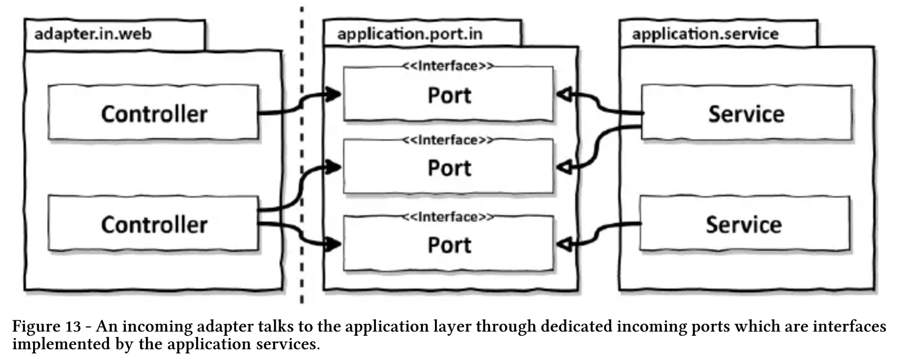

# 05 웹 어댑터 구현하기

우리가 목표로 하는 아키텍처에서 외부 세계와의 모든 커뮤니케이션은 어댑터를 통해 이뤄진다. 이번에는 웹 인터페이스를 제공하는 어댑터의 구현 방법을 살펴보자.

## 의존성 역전

웹 어댑터는 `주도하는`, 혹은 `인커밍` 어댑터다. 인커밍 어댑터는 애플리케이션 서비스에 의해 구현된 인터페이스인 전용 포트를 통해 애플리케이션 계층과 통신한다. 이 구조에는 **의존성 역전 원칙**이 적용되어있다.

> **컨트롤러에서 바로 서비스를 바라봐도 되잖아?**
>
> 애플리케이션 코어가 외부 세계와 통신할 수 있는 곳에 대한 명세가 포트이다. 외부와 어떤 통신이 일어나는지 정확히 알 수 있고, 이는 유지보수에 도움이 된다.

## 어댑터의 책임

*"좋은 아키텍처는 선택의 여지를 남겨둔다."*

1. HTTP 요청을 자바 객체로 매핑

   > HTTP 와 관련된 모든 것은 애플리케이션 계층으로 침투하지 않게 한다. 애플리케이션 코어에서는 바깥 계층에서 HTTP를 쓰든 뭐를 쓰든 몰라야 한다.

2. 권한 검사

3. 입력 유효성 검증

4. 입력을 유스케이스의 입력 모델로 매핑

   > 웹 어댑터의 입력 모델을 유스케이스의 입력 모델로 변환할 수 있다는 것을 검증해야한다.

5. 유스케이스 호출

6. 유스케이스의 출력을 HTTP 매핑

7. HTTP 응답을 반환

## 컨트롤러 나누기

- 컨트롤러는 너무 적은 것 보다는 많은게 낫다. 
  - 각 클래스의 코드량이 줄고 테스트 코드 또한 줄기 때문에 파악 난이도가 낮아진다.
  - 큰 컨트롤러는 모델 클래스를 공유하기 쉽게 만든다.
  - 메서드와 클래스명은 유스케이스를 최대한 반영해서 지어야한다.

> 🤔 컨트롤러 만의 모델은 어디에 두는가?

## 정리

웹 어댑터는 HTTP 요청을 애플리케이션의 유스케이스에 대한 메서드 호출로 변환하고 결과를 다시 HTTP로 변환하고 **어떤 도메인 로직도 수행하지 않는 어댑터**이다. 이렇게 함으로서 웹 어댑터를 다른 어댑터로 쉽게 바꿀 수 있다.

