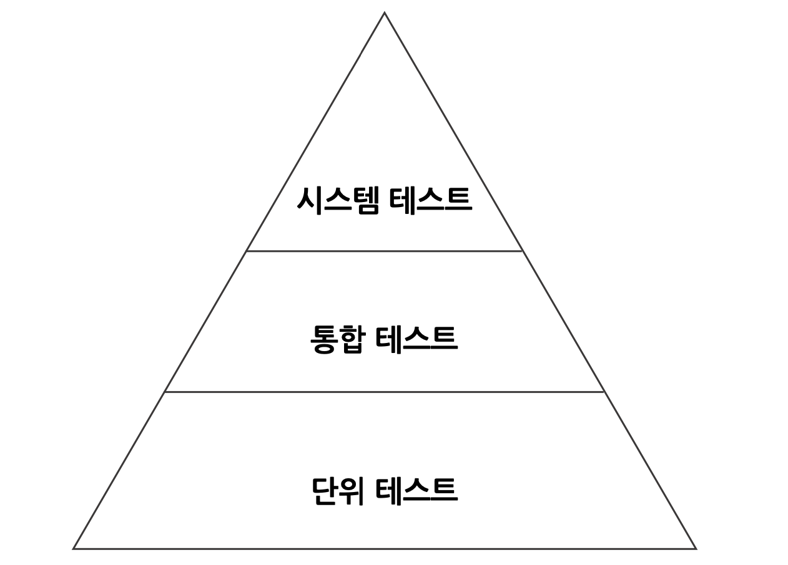

# 07 아키텍처 요소 테스트하기

육각형 아키텍처에서의 테스트 전략에 대해 얘기한다. 각 요소들을 테스트할 수 있는 테스트 유형을 알아보자.


## 테스트 피라미드



***테스트 피라미드***

만드는 비용이 적고, 유지보수하기 쉽고, 빨리 실행되고, 안정적인 작은 크기의 테스트들에 대해 높은 커버리지를 유지해야 한다. 그건 바로 단위 테스트이다. 여러 단계를 넘는 경계를 테스트하는 것은 비용이 비싸지고 느려진다. 이렇게 비싼 테스트는 위로 커버리지 목표를 낮게 잡아야한다는 것을 테스트 피라미드는 보여준다.

이 책에서의 테스트:

- 단위 테스트
  - 하나의 클래스를 인스턴스화하고 해당 클래스의 인터페이스를 통해 기능들을 테스트한다.
  - 다른 클래스에 의존해야할 때는 의존되는 클래스를 인스턴스화하지 않고 목(mock)으로 대체한다.
- 통합 테스트
  - 여러 유닛을 인스턴스화하고 시작점이 되는 클래스의 인터페이스로 데이터를 보낸 후 유닛들의 네트워크에 대한 테스트를 진행한다.
  - 두 계층 간의 경계를 걸쳐 테스트하기 때문에 네트워크가 완전하지 않은 부분은 목으로 대체한다.
- 시스템 테스트
  - 모든 객체 네트워크를 가동시켜 특정 유스케이스가 전 계층에서 잘 동작하는지 검증한다.
- 엔드 투 엔드 테스트
  - 논외


## 단위 테스트로 도메인 엔티티 테스트하기

도메인 엔티티에 녹아 있는 비즈니스 규칙 검증한다. 도메인 엔티티의 행동은 다른 클래스에 거의 의존하지 않기 때문에 다른 종류의 테스트는 필요하지 않다.


## 단위 테스트로 유스케이스 테스트하기

```java
class SendMoneyServiceTest {

	private final LoadAccountPort loadAccountPort =
			Mockito.mock(LoadAccountPort.class);

	private final AccountLock accountLock =
			Mockito.mock(AccountLock.class);

	private final UpdateAccountStatePort updateAccountStatePort =
			Mockito.mock(UpdateAccountStatePort.class);

	private final SendMoneyService sendMoneyService =
			new SendMoneyService(loadAccountPort, accountLock, updateAccountStatePort, moneyTransferProperties());

	@Test
	void transactionSucceeds() {

		Account sourceAccount = givenSourceAccount();
		Account targetAccount = givenTargetAccount();

    // Given
		givenWithdrawalWillSucceed(sourceAccount);
		givenDepositWillSucceed(targetAccount);

		Money money = Money.of(500L);

		SendMoneyCommand command = new SendMoneyCommand(
				sourceAccount.getId().get(),
				targetAccount.getId().get(),
				money);

    // When
		boolean success = sendMoneyService.sendMoney(command);

		assertThat(success).isTrue();

		AccountId sourceAccountId = sourceAccount.getId().get();
		AccountId targetAccountId = targetAccount.getId().get();

    // Then
		then(accountLock).should().lockAccount(eq(sourceAccountId));
		then(sourceAccount).should().withdraw(eq(money), eq(targetAccountId));
		then(accountLock).should().releaseAccount(eq(sourceAccountId));

		then(accountLock).should().lockAccount(eq(targetAccountId));
		then(targetAccount).should().deposit(eq(money), eq(sourceAccountId));
		then(accountLock).should().releaseAccount(eq(targetAccountId));

		thenAccountsHaveBeenUpdated(sourceAccountId, targetAccountId);
	}

	
}
```

이 테스트는 마치 통합테스트처럼 보이지만 각 객체를 목으로 작업하고 있고 실제 의존성을 관리해야하는 것은 아니기 때문에 완전 통합 테스트는 아니다.

- 테스트 **가독성**을 높이기 위해 **행동 주도 개발**에서 일반적으로 사용되는 방식으로 작성
  - given / when / then
    - given → 테스트에 필요한 것들을 준비
    - when → 테스트 하려하는 행위 호출
    - then → 테스트로 인해 의도된 행위가 호출되었는지, 원하는 상태 변화가 발생했는지 검증
- 이때 테스트에서 특정 메서드와 상호작용했는지 여부를 검증하는 경우
  - 테스트가 코드의 행동 변경뿐만 아니라 코드의 구조 변경에도 취약해진다.
  - 코드가 리팩토링되면 <u>테스트도 변경될 확률이 높아진다.</u>
  - 즉, 신중하게 생각해야한다.
  - <u>모든 동작을 검증하려는 것보다, 중요한 핵심에 집중해서 테스트하자.</u>


## 통합 테스트로 웹 어댑터 테스트하기

```java
@WebMvcTest(controllers = SendMoneyController.class)
class SendMoneyControllerTest {

	@Autowired
	private MockMvc mockMvc;

	@MockBean
	private SendMoneyUseCase sendMoneyUseCase;

	@Test
	void testSendMoney() throws Exception {

		mockMvc.perform(post("/accounts/send/{sourceAccountId}/{targetAccountId}/{amount}",
				41L, 42L, 500)
				.header("Content-Type", "application/json"))
				.andExpect(status().isOk());

		then(sendMoneyUseCase).should()
				.sendMoney(eq(new SendMoneyCommand(
						new AccountId(41L),
						new AccountId(42L),
						Money.of(500L))));
	}

}
```

웹 어댑터 테스트는 아래의 것들이 모두 기대한 대로 동작하는지 검증한다.

1. JSON 문자열 등의 형태로 HTTP를 통해 입력 받기
2. 입력에 대한 유효성 검증
3. 유스케이스에서 사용할 수 있는 포맷으로 매핑
4. 유스케이스에 전달
5. 유스케이스의 결과를 JSON으로 매핑
6. HTTP 응답을 통해 클라이언트에 반환

> 이 테스트가 단위 테스트가 아닌 통합테스트인 이유는 하나의 웹 컨트롤러 클래스만 테스트한 것처럼 보이지만, 사실 보이지 않는 곳에서 <u>더 많은 일들이 벌어지고 있다.</u> `@WebMvcTest` 애너테이션은 스프링이 특정 요청 경로, 자바와 JSON 간의 매핑, HTTP 입력 검증 등을 처리하는 빈들을 인스턴스화 해준다. 웹 컨트롤러가 <u>스프링과 강하게 엮여 있기 때문에</u> 프레임워크와 함께 테스트하는 것이다.


## 통합 테스트로 영속성 어댑터 테스트하기

```java
@DataJpaTest
@Import({AccountPersistenceAdapter.class, AccountMapper.class})
class AccountPersistenceAdapterTest {

	@Autowired
	private AccountPersistenceAdapter adapterUnderTest;

	@Autowired
	private ActivityRepository activityRepository;

	@Test
	@Sql("AccountPersistenceAdapterTest.sql")
	void loadsAccount() {
		Account account = adapterUnderTest.loadAccount(new AccountId(1L), LocalDateTime.of(2018, 8, 10, 0, 0));

		assertThat(account.getActivityWindow().getActivities()).hasSize(2);
		assertThat(account.calculateBalance()).isEqualTo(Money.of(500));
	}

	@Test
	void updatesActivities() {
		Account account = defaultAccount()
				.withBaselineBalance(Money.of(555L))
				.withActivityWindow(new ActivityWindow(
						defaultActivity()
								.withId(null)
								.withMoney(Money.of(1L)).build()))
				.build();

		adapterUnderTest.updateActivities(account);

		assertThat(activityRepository.count()).isEqualTo(1);

		ActivityJpaEntity savedActivity = activityRepository.findAll().get(0);
		assertThat(savedActivity.getAmount()).isEqualTo(1L);
	}

}
```

- 웹 어댑터 테스트와 비슷한 이유로, 영속성 어댑터도 통합 테스트 적용이 합리적이다.

- `@DataJpaTest` 사용하면 스프링 데이터 리포지토리들을 포함해서 DB 접근에 필요한 객체 네트워크를 인스턴스화해야 한다고 스프링에 알려준다. 

- 이 테스트에서 DB를 모킹하지 않는다.즉, DB에 접근하게 된다. 모킹을 이용할 경우, 실제 DB와 연동했을 때, SQL 구문의 오류나 DB 테이블과 자바 객체 간의 매핑 에러 등으로 문제가 생길 확률이 높아지기 때문이다.

> ⚠️ 스프링에서는 기본적으로 인메모리 DB를 테스트에서 사용한다. 하지만 프로덕션 환경에서 인메모리 DB를 사용하는 경우는 적기 때문에, 인메모리 DB에서 테스트를 통과했더라도 실제 DB에서 문제가 생길수도 있다. 즉, 영속성 어댑터 테스트는 실제 DB를 대상으로 진행하는 것이 좋다!


## 시스템 테스트로 주요 경로 테스트하기

```java
@SpringBootTest(webEnvironment = WebEnvironment.RANDOM_PORT)
class SendMoneySystemTest {

	@Autowired
	private TestRestTemplate restTemplate;

	@Test
	@Sql("SendMoneySystemTest.sql")
	void sendMoney() {

		Money initialSourceBalance = sourceAccount().calculateBalance();
		Money initialTargetBalance = targetAccount().calculateBalance();

		ResponseEntity response = whenSendMoney(
				sourceAccountId(),
				targetAccountId(),
				transferredAmount());

		then(response.getStatusCode())
				.isEqualTo(HttpStatus.OK);

		then(sourceAccount().calculateBalance())
				.isEqualTo(initialSourceBalance.minus(transferredAmount()));

		then(targetAccount().calculateBalance())
				.isEqualTo(initialTargetBalance.plus(transferredAmount()));

	}

	private ResponseEntity whenSendMoney(
			AccountId sourceAccountId,
			AccountId targetAccountId,
			Money amount) {
		HttpHeaders headers = new HttpHeaders();
		headers.add("Content-Type", "application/json");
		HttpEntity<Void> request = new HttpEntity<>(null, headers);

		return restTemplate.exchange(
				"/accounts/send/{sourceAccountId}/{targetAccountId}/{amount}",
				HttpMethod.POST,
				request,
				Object.class,
				sourceAccountId.getValue(),
				targetAccountId.getValue(),
				amount.getAmount());
	}

}
```

시스템 테스트는 전체 애플리케이션을 띄우고 API를 통해 요청을 보내고, 모든 계층이 조화롭게 잘 동작하는지 검증한다.

- `@SpringBootTest` 사용하여 스프링이 애플리케이션을 구성하는 모든 객체 네트워크를 띄우게 한다.

- MockMvc가 아닌 **TestRestTemplate**를 이용한다. **실제 HTTP 통신**을 수행한다. 그리고 실제 HTTP 통신을 하는 것처럼 실제 출력 어댑터도 사용한다.

- 지저분한 로직들은 **헬퍼 메서드** 안으로 숨겼다. 이 헬퍼 메서드들은 여러 가지 상태를 검증할 때 사용할 수 있는 **DSL**(도메인 특화 언어, 특정한 도메인을 적용하는 데 특화된 언어)을 형성하여 가독성을 증가 시킨다.
- 시스템 테스트는 훨씬 더 실제 사용자와 유사하다. 사용자 관점에서 애플리케이션을 검증할 수 있다.
- 시스템 테스트는 단위 테스트와 통합 테스트가 발견하는 버그와는 또 다른 종류의 버그를 발견해서 수정할 수 있게 해준다.


## 얼마만큼의 테스트가 충분할까?

라인 커버리지는 큰 의미 없다. 다음의 테스트 전략 정도를 정하자.

- 도메인 엔티티 구현 시 단위 테스트로 커버
- 유스케이스 구현 시 단위 테스트로 커버
- 어댑터 구현 시 통합 테스트 커버
- 사용자가 취할 수 있는 주요 경로는 시스템 테스트로 커버

> ⚠️ 리팩터링 할 때마다 테스트 코드가 변경된다면 테스트로서의 가치를 잃는다. 테스트도 변경에 취약하지 않게 짜자.


## 정리

육각형 아키텍처는 도메인 로직과 어댑터를 깔끔하게 분리하므로 도메인 로직은 단위 테스트, 어댑터는 통합 테스트로 처리하는 명확한 테스트 전략을 취할 수 있다. 또한 포트는 테스트에서 아주 뚜렷한 모킹 지점이 된다. 각 포트에 대해 모킹할 지 실제 구현을 이용할지 선택할 수 있다. 

> ⚠️ 모킹하는 것이 버거워지거나 코드 특정 부분을 커버하기 위해 어떤 종류의 테스트를 써야할지 모르겠다면 경고 신호다.


## 논의

🗣 지현 : 한 스키마에 컬럼이 4~5개 있다. 컬럼에다 바이너리 형태로 변환해서 저장하고 있다. 하나의 오브젝트가 바이너리로 변환되서 저장되는 형태. 헥사고날 하다가 기존 레파지토리 참조하는 것을 오프라인이 지원되는데 큐를 쌓아서 한번에 요청을 보낸다. 매번 디비에 접근하는게 비효율적이라 판단되서 인 메모리로 캐싱한다. (클라이언트에서 오프라인 요청을 보낼 때이다.) 인메모리는 인메모리 디비가 아닌 머신의 메모리, 힙을 쓴다. 이 때 어댑터에 놓을까?

🗣 혁진 : 저는 어댑터에 놓습니다. 인메모리가 레디스나 영구 저장 디비로 바꿀 때도 어댑터만 바꾸게. 팀이 다 그렇다면 그렇게 할수도 있을 것 같습니다. 그냥 레디스를 쓰자를 밀어 붙여보자.

🗣 종민 : 무조건 어댑터일 것 같습니다. 인메모리 해시맵 이런게 아니고 라이브러리 쓰시지 않을까요? 메모리에 캐시한다는게 유스케이스가 아예 다른가요? 요청이 들어오면 캐시 먼저 찔러보는게 아니고 바로 해당 유스케이스에 찌르는거죠?

🗣 혁진 : 차라리 캐싱을 스프링처럼 프록시로 만들어서 어댑터로 사용하지 않는 방법도 있을 것 같다.

🗣 종민 : 저는 DB 조회를 캐시 쪽으로 넣어서 델리게이트 패턴을 쓸 것 같아요

