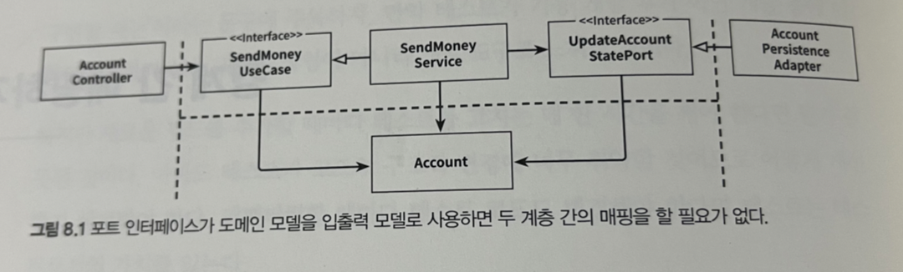
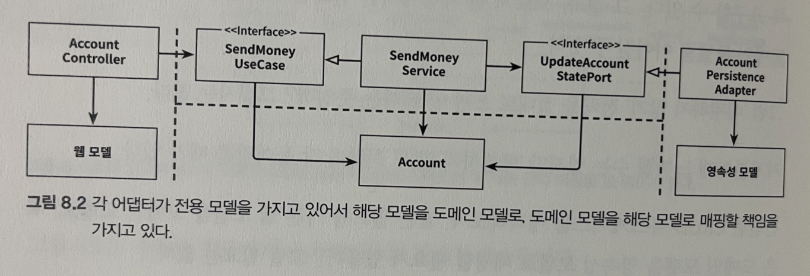
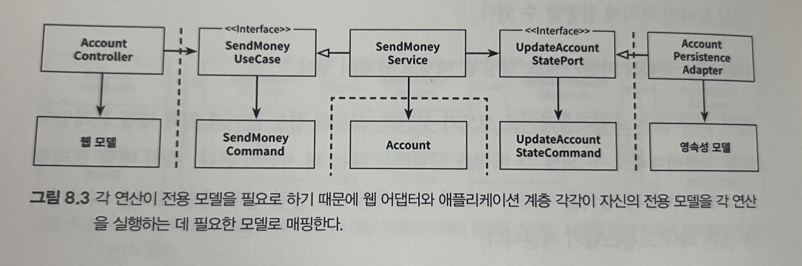
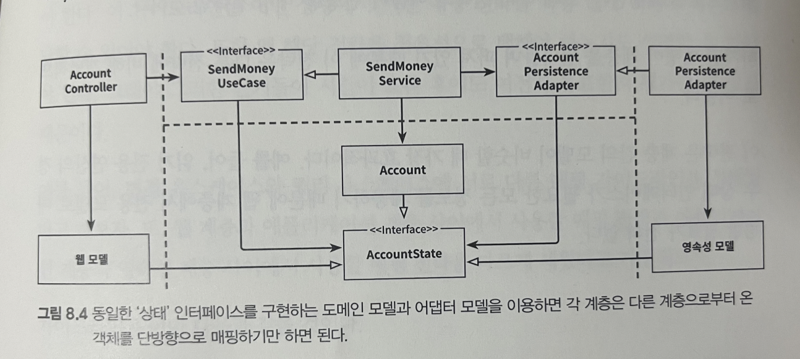

# 08. 경계 간 매핑하기

각 계층의 모델 매핑하는 문제에 대해 논쟁의 여지가 있다.


**매핑에 찬성하는 개발자 :** 
두 계층 간 매핑을 하지 않으면 양 계층에서 같은 모델을 사용해야 하는데, 이러면 두 계층간 강결합이 발생된다.

**매핑에 반대하는 개발자 :**
두 계층간 매핑을 하게 되면 보일러 플레이트 코드가 많이 발생된다. 많은 유즈케이스들이 오직 CRUD만 수행하고 계층에 걸쳐 같은 모델을 사용하기 때문에 계층 사이의 매핑은 과하다.


## '매핑하지 않기' 전략



`SendMoneyService`와 `SendMoneyUseCase`, `UpdateAccountStatePort` 까지 같은 모델을 사용하여 계층간 매핑을 하지 않는다.

이런 설계는 웹 계층에서 REST로 모델을 노출시킨다면 JSON으로 직렬화하기 위한 annotation을, ORM 프레임워크를 사용한다면 영속성 계층에는 DB 매핑을 위한 특정 annotation을 붙여야 한다. 

이는 곧 `단일 책임 원칙`을 위반하게 된다.

만약 모든 계층이 정확하게 같은 구조, 같은 정보를 필요로 한다면 '매핑하지 않기' 전략은 좋은 선택지이다. 하지만 애플리케이션 혹은 도메인 계층에서 웹과 영속성 문제를 다룬다면 다른 전략을 취해야 한다.


## '양방향' 매핑 전략

각 계층이 전용 모델을 가진 매핑 전략을 '양방향(Two-Way)' 매핑 전략이라고 한다.



웹 계층에서는 

1) 웹 모델을 인커밍 포트에서 필요한 도메인 모델로 매핑하고,
2) 인커밍 포트에 의해 반환된 도메인 객체를 다시 웹 모델로 매핑한다.

각 계층이 전용 모델을 가지고 있는 덕분에 각 계층이 전용 모델을 변경하더라도 다른 계층에는 영향이 없다.
또한, '매핑하지 않기' 전략처럼 간단하며 매핑 책임이 명확하다. 안쪽 계층은 해당 계층의 모델만 알면 되고, 매핑 대신 도메인 로직에 집중할 수 있다.

단점은 다음과 같다.

1. 너무 많은 보일러 플레이트 코드가 생긴다. 설령 매핑 프레임워크를 사용하더라도 매핑을 구현하는 데에 꽤 시간이 든다.
2. 도메인 모델이 계층 경계를 넘어서 통신하는데 사용되고 있다. 인커밍 포트와 아웃고잉 포트는 도메인 객체를 입력 파라미터와 반환 값으로 사용한다. 이때 도메인 모델은 바깥쪽 계층의 요구에 따른 변경에 취약해진다.

'양방향' 매핑 전략 또한 은총알은 아니다.


## '완전' 매핑 전략



이 매핑 전략에서는 각 연산마다 별도의 입출력 모델을 사용한다.

훨씬 많은 매핑 코드가 필요하지만, 이렇게 매핑하면 여러 유스케이스의 요구사항을 함께 다뤄야 하는 매핑에 비해 구현 및 유지보수가 훨씬 쉽다.

이 매핑전략은 전역 패턴보다는 웹 계층(혹은 인커밍 어댑터 중 아무거나)과 애플리케이션 계층 사이에서 상태 변경 유스케이스의 경계를 명확하게 할 때 가장 유리하다. 

또 연산의 입력 모델에 대해서만 이 매핑을 사용하고, 도메인 객체를 그대로 출력 모델로 사용하는 것도 좋다.
이처럼 매핑 전략은 여러가지를 섞어 써야만 한다.


## '단방향' 매핑 전략



모든 계층의 모델들이 같은 인터페이스를 구현한다. 이 인터페이스는 관련 있는 특성에 대한 getter 메소드를 제공하여 도메인 모델 상태를 캡슐화 한다.

도메인 모델 자체는 풍부한 행동을 구현할 수 있고, 도메인 객체를 바깥 계층으로 전달하고 싶으면 매핑없이 할 수 있다.

바깥 계층에서 애플리케이션 계층으로 전달하는 객체들도 이 상태 인터페이스를 구현하고 있는데, 애플리케이션 계층에서는 이 객체를 실제 도메인 모델로 매핑해서 도메인 모델의 행동에 접근할 수 있게 된다. 이 매핑은 factory(DDD 용어)와 잘 어울린다.

```tex
factory : 다른 객체를 생성하는 역할만을 수행하는 객체
(어떤 특정한 상태로부터 도메인 객체를 재구성할 책임을 가지고 있다. )
```


이 전략은 계층 간의 모델이 비슷할 때 가장 효과적이다.


## 언제 어떤 매핑 전략을 사용할 것인가?

그때 그때 다르다.

팀 내 가이드라인이 잘 정의되어있어야 하며, 지속적으로 논의하고 수정해야 한다.


```tex
1. 어떤 매핑 방식을 쓰시는지, 완전 매핑인 경우 입출력을 다 다루는지? 
지현) 완전 매핑
혁진,종민) 영속성 제외 매핑, 여러가지 섞어 씀

2. 출력 모델이 있는 경우 어떤 명칭으로 하는지?
지현) Response
종민) extension 함수 사용
혁진) 출력은 도메인 레이어 안에서 도메인 그대로 사용

```

