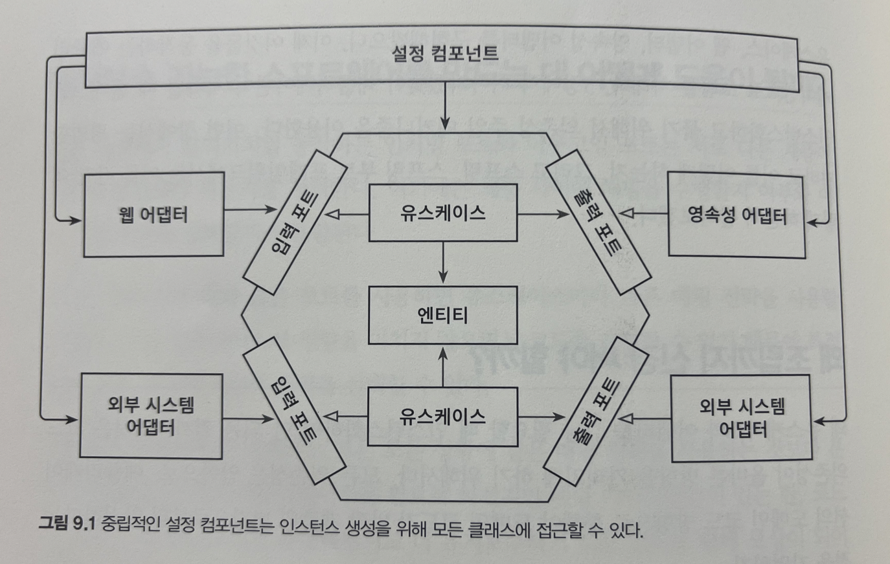

# 09. 애플리케이션 조립하기

애플리케이션이 시작될 때 클래스를 인스턴스화하고 묶기 위해서 의존성 주입 매커니즘을 이용한다. 스프링, 스프링부트 프레임워크, 자바에서는 어떻게 하는지 살펴보자


## 왜 조립까지 신경써야 할까?

왜 유스케이스와 어댑터를 그냥 필요할 때 인스턴스화하면 안되는걸까?

그것은 코드 의존성이 올바른 방향을 가리키게 하기 위해서다. 모든 의존성은 안쪽으로, 애플리케이션의 도메인 코드방향으로 향해야 도메인 코드가 바깥 계층의 변경으로부터 안전하다.



객체 인스턴스를 생성할 책임은 모든 클래스에 대한 의존성을 가지는 설정 컴포넌트에 있어야 한다.

클린 아키텍처에서 이 설정 컴포넌트는 원의 가장 바깥쪽에 위치한다.

이 컴포넌트는 다음과 같은 역할을 수행해야 한다.

- 웹 어댑터 인스턴스 생성
- HTTP 요청이 실제로 웹 어댑터로 전달되도록 보장
- 유스케이스 인스턴스 생성
- 웹 어댑터에 유스케이스 인스턴스 제공
- 영속성 어댑터 인스턴스 생성
- 유스케이스에 영속성 어댑터 인스턴스 제공
- 영속성 어댑터가 실제로 DB에 접근할 수 있도록 보장
- 설정 파일, 커맨드라인 파라미터와 같은 설정 파라미터 소스에 접근

책임이 굉장히 많으므로 단일책임 원칙을 위반하는 것은 맞지만, 애플리케이션의 나머지 부분을 깔끔하게 유지하고 싶다면 이런 컴포넌트가 필요하다.


## 평범한 코드로 조립하기

```java
package copyeditor.configuration;

class Application {
  public static void main(String[] args) {
    AccountRepository accountRepository = new AccountRepository();
    ActivitiRepository activitiRepository = new ActivityRepository();
    
    AccountPersistenceAdapter accountPersistenceAdapter = new AccountPersistenceAdapter(accountRepository, activityRepository);
    
    SendMoneyUseCase sendMoneyUseCase = new SendMoneyUseService(accountPersistenceAdapter, accountPersistenceAdapter);
    
    SendMoneyController sendMoneyController = new SendMoneyContoller(sendMoneyUseCase);
    
    startProcessingWebRequests(snedMoneyController);
  }
}
```

애플리케이션을 조립하는 가장 기본적인 방법이지만 몇가지 단점이 있다.

- 웹 컨트롤러, 유스케이스, 영속성 어댑터가 여러개면 더 복잡해진다
- 각 클래스가 속한 패키지 외부에서 인스턴스를 생성하기 때문에 이 클래스들은 모두 public이어야 한다.


## 스프링의 클래스패스 스캐닝으로 조립하기

스프링 프레임워크를 이용해서 애플리케이션을 조립한 결과물을 **애플리케이션 컨텍스트**라하며, 애플리케이션 컨텍스트는 애플리케이션을 구성하는 모든 객체(bean)을 포함한다.

스프링은 클래스패스 스캐닝으로 클래스패스에서 접근 가능한 모든 클래스를 확인해서 @Component 애너테이션이 붙은 클래스를 찾고, 해당 클래스의 객체를 생성한다. 이 때, 클래스는 모든 필드를 인자로 받는 생성자를 가지고 있어야 한다,

```java
@RequiredArgsConstructor // lombok 사용
@Component
class AccountPersistenceAdapter implements LoadAccountPort, UpdateAccountStateProt {
  ...
}
```


스프링이 인식하는 애너테이션을 직접 만들 수도 있다.

```java
@Target({ElementType.TYPE})
@Retention(RetentionPolicy.RUNTIME)
@Documented
@Component
public @interface PersistenceAdapter {
  
  @AliasFor(annotation = Component.class)
  String value() default "";

}
```

클래스패스 스캐닝 방식의 단점은 다음과 같다.

- 클래스에 프레임워크에 특화된 애너테이션을 붙여야 한다.
- 부수 효과를 야기할 수 있다. 우리는 모든 클래스 하나하나에 대해서 자세하게 알고있지 않기 때문이다.


## 스프링의 자바 컨피그로 조립하기

```java
@Configuration
@EnableJpaRepositories
class PersistenceAdapterConfiguration {
  @Bean
  AccountPersistenceAdapter accountPersistencAdapter(...)
  
  @Bean
  AccountMapper accountMapper(){...}
}
```

@Configuration 애너테이션을 통해 스프링의 클래스패스 스캐닝에서 발견해야 할 설정 클래스임을 표시한다. 사실 여전히 클래스패스 스캐닝을 사용하지만, 모든 빈을 가져오는 대신 설정 클래스만 선택하기 때문에 부수효과가 발생할 확률을 줄일 수 있다,

테스트에 유연성을 부여하며, @Component 애너테이션을 여기저기에 붙이도록 강제하지 않아, 스프링 프레임워크에 대한 의존성 없이 애플리케이션 계층을 깔끔하게 유지할 수 있다.

다만, 설정 클래스가 생성하는 빈이 설정 클래스와 같은 패키지에 존재하지 않는다면 public으로 만들어야 한다.


## 유지보수 가능한 소프트웨어를 만드는데 어떻게 도움이 될까?

- 클래스패스 스캐닝

  - 편리하고, 빠르개 개발할 수 있다.
  - 투명성이 낮아진다.
  - 테스트의 유연성이 떨어진다.

- 전용 설정 컴포넌트

  - SOLID에서 단일책임 원칙을 지킬 수 있다.

  - 응집도가 매우 높다.

  - 설정 컴포넌트를 유지보수 하는데 시간을 들여야한다.

    

```tex
혁진님: 대부분 클래스 패스 스캐닝
종민님: 섞어쓴다. 별도 모듈로 분리할 수 있는 구조
```

