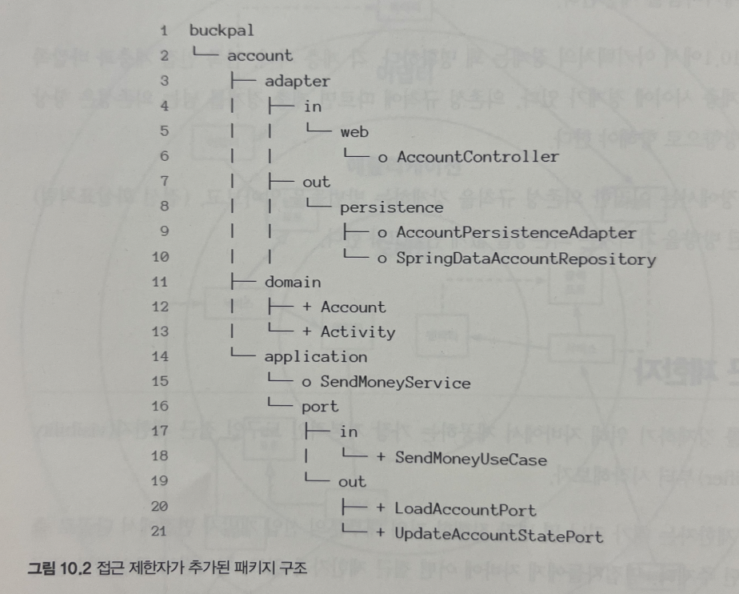

# 10. 아키텍처 경계 강제하기

## 경계와 의존성

아키텍처 경계를 강제한다는 것은 의존성이 올바른 방향을 향하도록 강제하는 것을 의미한다.
의존성 규칙에 따르면 계층 경계를 넘는 의존성은 항상 안쪽 방향으로 향해야 한다.

의존성 규칙을 강제하는 방법과 잘못된 방향을 가리키는 의존성을 없게 만들어보자

## 접근제한자

`public`, `protected`, `private` 제한자 외에도 `package-private('default')` 제한자가 있다.

`package-private` 제한자가 왜 중요할까?

자바 패키지를 통해 클래스들을 응집적인 모듈로 만들어주기 때문이다. 이러한 모듈 내에 있는 클래스들은 서로 접근 가능하지만 패키지 바깥에서는 접근할 수 없다.

그럼 모듈의 진입점으로 활용될 클래스들만 골라서 public으로 만들어주면 되고 이렇게 하면 의존성 규칙을 위반할 위험이 줄어든다.

persistence 패키지에 있는 클래스들은 외부에서 접근할 필요가 없기 때문에 package-private(o)로 만들 수 있다. 영속성 어댑터는 자신이 구현하는 출력 포트틀 통해 접근된다.

SendMoneyService도 동일하게 package-private으로 만들 수 있다. 의존성 주입 매커니즘은 일반적으로 리플렉션을 이용해 클래스를 인스턴스로 만들기 때문에 package-private이어도 여전히 인스턴스를 만들 수 있다.

이방법을 스프링에서 사용하려면 클래스패스 스캐닝을 이용해야한다.

package-private 제한자는 몇 개 정도의 클래스로만 이뤄진 작은 모듈에서 가장 효과적이다. 만약 클래스가 많아지면 코드를 쉽게 찾을 수있도록 하위 패키지를 만들게 되고, 이렇게 되면 package-private을 더이상 활용할 수 없게된다.

## 컴파일 후 체크

클래스에 public 제한자를 쓰면 아키텍쳐 상의 의존성 방향이 잘못되더라도 컴파일러는 다른 클래스들이 이 클래스를 사용하도록 허용한다. 이때는 컴파일 후 체크 방법을 도입할 수 있다. 즉, 런타임에 체크한다는것이다. 이러한 런타임 체크는 지속적인 통합 빌드 환경에서 자동화된 테스트 과정에서 가장 잘 동작한다.

이러한 체크를 도와주는 자바용 도구로 ArchUnit이 있다. 의존성 방향이 기대한 대로 잘 설정되어 있는지 체크하는 API를 제공한다.

해당 방식은 오타가 하나라도 나거나 패키지명을 하나만 리팩터링해도 테스트 전체가 무의미해질 수 있으므로, 클래스를 하나도 찾지 못했을 때 실패하는 테스트를 추가해야 한다. 하지만 그래도 여전히 리팩토링에 취약하다.

## 빌드 아티팩트

빌드아티팩트는 빌드프로세스의 결과물이다.

빌드 도구의 주요 기능 중 하나는 의존성 해결이다. 
어떤 코드 베이스를 빌드 아티팩트로 변환하기 위해 빌드도구가 가장 먼저 할 일은 코드베이스가 의존하고 있는 모든 아티팩트가 사용 가능한지 확인하는 것이다. 만약 사용 불가능한 것이 있다면 아티팩트 리포지토리로부터 가져오려고 시도하고, 이것마저 실패한다면 코드를 컴파일도 하기전에 에러와 함께 빌드가 실패한다.

이를 활용해서 모듈과 아키텍처 계층간 의존성을 강제할 수 있다.

각 모듈 혹은 계층에 대해 코드베이스와 빌드 아티팩트로 분리된 빌드모듈(JAR 파일)을 만들고 각 모듈의 빌드 스크립트에서는 아키텍처에서 허용하는 의존성만 지정한다.

모듈을 더 세분화할수록 의존성을 더 잘 제어할 수 있지만 모듈간에 매핑을 더 많이 수행해야 한다.

빌드 모듈로  아키텍처 경계를 구분하는 것은 패키지로 구분하는 방식과 비교했을 때 몇가지 장점이 있다.

- 빌드 도구가 순환 의존성을 허용하지 않는다.
- 다른 모듈을 고려하지 않고 특정 모듈의 코드를 격리한 채로 변경할 수 있다.
- 모듈 간 의존성이 빌드 스크립트에 분명하게 선언되어 있기 때문에 새로 의존성을 추가하는 일은 의식적인 행동으로 이루어진다.

하지만 빌드 스크립트를 유지보수하는 비용이 수반되기 때문에 아키텍처가 어느정도 안정된 상태여야 한다.