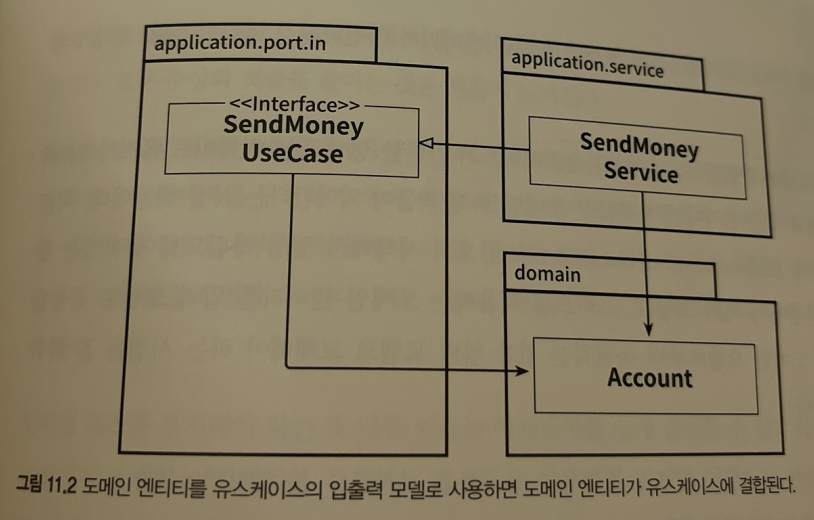

# 11. 의식적으로 지름길 사용하기

깨진 창문 이론 => 점점 코드 품질이 더 낮아질 수 있다.

하지만 때로는 지름길이 더 실용적일 수 있다. 이때는 문서를 정리하여, 의도적으로 우리가 지름길을 택했다는걸 팀원들에게 잘 알려야 한다.

## 유스케이스 간 모델 공유하기

유스케이스들이 기능적으로 묶여 있을 때, 즉 특정 요구사항을 공유할 때는 괜찮은 방식이다

## 도메인 엔티티를 입출력 모델로 사용하기

간단한 생성이나 업데이트 유스케이스에서는 유스케이스 인터페이스에 도메인 엔티티가 있는 것은 괜찮을 수 있다.

하지만 더 복잡한 로직을 구현해야 한다면 전용 입출력 모델을 만들어서 사용하자.

## 인커밍 포트 건너뛰기

추상화 계층을 줄일 수 있다.

하지만 인커밍 포트는 애플리케이션 중심에 접근하는 진입점으로, 이를 제거하면 애플리케이션 내부 동작에 대해서 더 잘 알고 있어야 한다.

전용 인커밍 포트를 유지하면 한눈에 진입점을 식별할 수 있다.

또한, 아키텍처를 쉽게 강제할 수 있다.

## 애플리케이션 서비스 건너뛰기

간단한 CRUD에서는 서비스를 건너 뛰고 싶을 수 잇다.

하지만 이 방법은 인커밍 어댑터와 아웃고잉 어댑터 사이에 모델을 공유해야 하고, 이 경우엔 공유해야 하는 모델이 도메인 엔티티이다.

